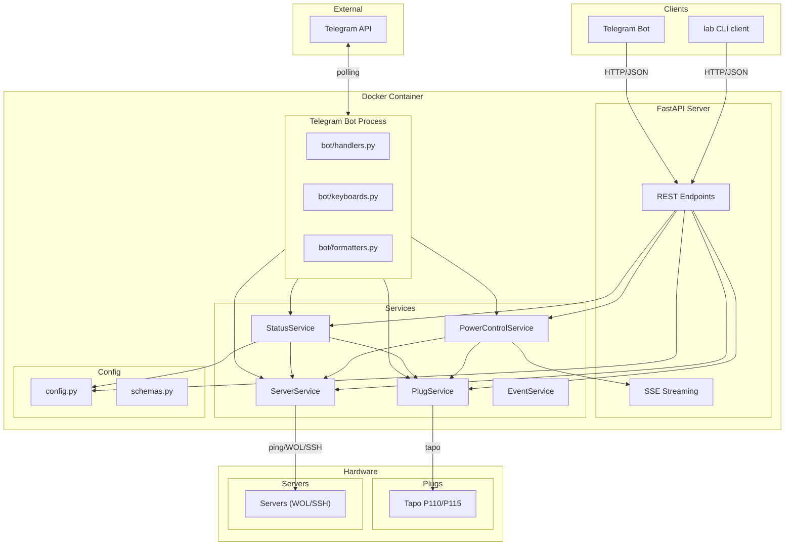

# Components

```mermaid
graph TB
    subgraph Clients
        CLI["lab CLI client"]
        BOT["Telegram Bot"]
    end

    subgraph External
        TG[Telegram API]
    end

    subgraph Server["Docker Container"]
        subgraph API["FastAPI Server"]
            ENDPOINTS["REST Endpoints"]
            SSE["SSE Streaming"]
        end

        subgraph BotProcess["Telegram Bot Process"]
            HANDLERS["bot/handlers.py"]
            KB["bot/keyboards.py"]
            FMT["bot/formatters.py"]
        end

        subgraph Services
            PS["PlugService"]
            SS["ServerService"]
            PWS["PowerControlService"]
            STS["StatusService"]
            ES["EventService"]
        end

        subgraph Config
            CFG["config.py"]
            SCHEMAS["schemas.py"]
        end
    end

    subgraph Hardware
        subgraph Plugs
            TAPO["Tapo P110/P115"]
        end
        subgraph Servers
            HW["Servers (WOL/SSH)"]
        end
    end

    CLI -->|HTTP/JSON| ENDPOINTS
    BOT -->|HTTP/JSON| ENDPOINTS
    ENDPOINTS --> PWS
    ENDPOINTS --> PS
    ENDPOINTS --> SS
    ENDPOINTS --> STS
    ENDPOINTS --> CFG
    PWS --> SSE
    TG <-->|polling| BotProcess
    BotProcess --> PS
    BotProcess --> SS
    BotProcess --> PWS
    BotProcess --> STS
    PS -->|tapo| TAPO
    SS -->|ping/WOL/SSH| HW
    PWS --> PS
    PWS --> SS
    STS --> PS
    STS --> SS
    STS --> CFG
```
