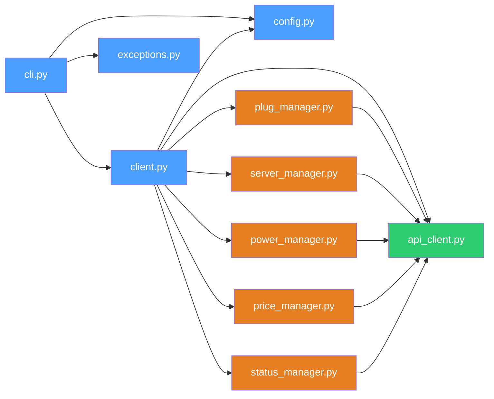
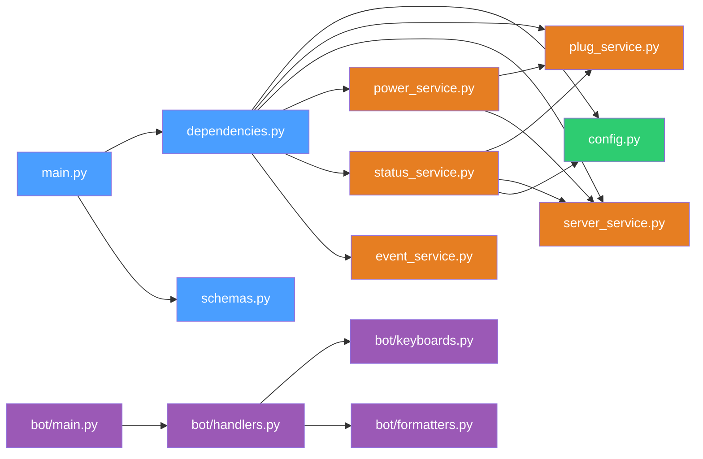

# Module Dependencies

## Client

```mermaid
graph LR
    cli[cli.py] --> client[client.py]
    cli --> config_c[config.py]
    cli --> exceptions[exceptions.py]

    client --> api_client[api_client.py]
    client --> config_c
    client --> plug_mgr[plug_manager.py]
    client --> server_mgr[server_manager.py]
    client --> power_mgr[power_manager.py]
    client --> price_mgr[price_manager.py]
    client --> status_mgr[status_manager.py]

    plug_mgr --> api_client
    server_mgr --> api_client
    power_mgr --> api_client
    price_mgr --> api_client
    status_mgr --> api_client

    style cli fill:#4a9eff,color:#fff
    style client fill:#4a9eff,color:#fff
    style config_c fill:#4a9eff,color:#fff
    style exceptions fill:#4a9eff,color:#fff
    style api_client fill:#2ecc71,color:#fff
    style plug_mgr fill:#e67e22,color:#fff
    style server_mgr fill:#e67e22,color:#fff
    style power_mgr fill:#e67e22,color:#fff
    style price_mgr fill:#e67e22,color:#fff
    style status_mgr fill:#e67e22,color:#fff
```

Blue = entry/config, Green = API layer, Orange = managers.

## Server

```mermaid
graph LR
    main[main.py] --> deps[dependencies.py]
    main --> schemas[schemas.py]

    deps --> config[config.py]
    deps --> plug_svc[plug_service.py]
    deps --> server_svc[server_service.py]
    deps --> power_svc[power_service.py]
    deps --> status_svc[status_service.py]
    deps --> event_svc[event_service.py]

    power_svc --> plug_svc
    power_svc --> server_svc

    status_svc --> plug_svc
    status_svc --> server_svc
    status_svc --> config

    bot_main[bot/main.py] --> handlers[bot/handlers.py]
    handlers --> keyboards[bot/keyboards.py]
    handlers --> formatters[bot/formatters.py]

    style main fill:#4a9eff,color:#fff
    style deps fill:#4a9eff,color:#fff
    style schemas fill:#4a9eff,color:#fff
    style config fill:#2ecc71,color:#fff
    style plug_svc fill:#e67e22,color:#fff
    style server_svc fill:#e67e22,color:#fff
    style power_svc fill:#e67e22,color:#fff
    style status_svc fill:#e67e22,color:#fff
    style event_svc fill:#e67e22,color:#fff
    style bot_main fill:#9b59b6,color:#fff
    style handlers fill:#9b59b6,color:#fff
    style keyboards fill:#9b59b6,color:#fff
    style formatters fill:#9b59b6,color:#fff
```

Blue = API layer, Green = config, Orange = services, Purple = Telegram bot.
