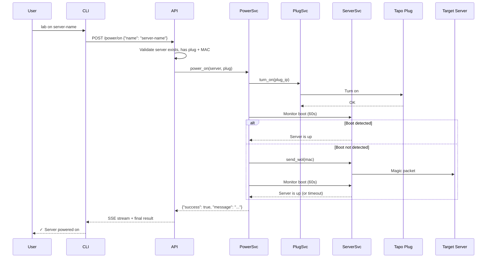
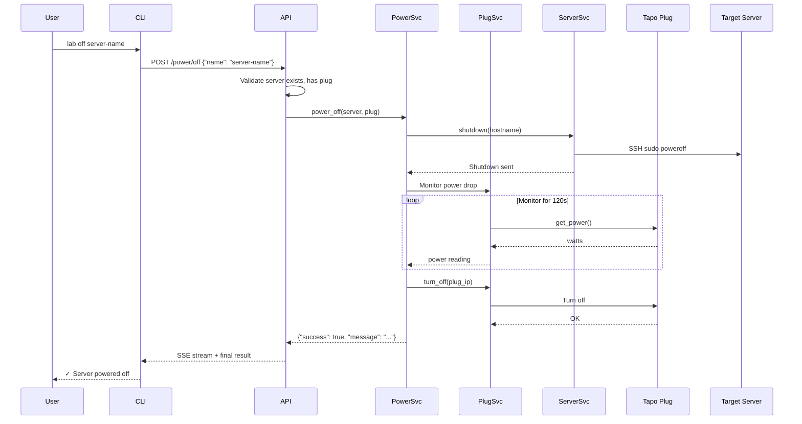
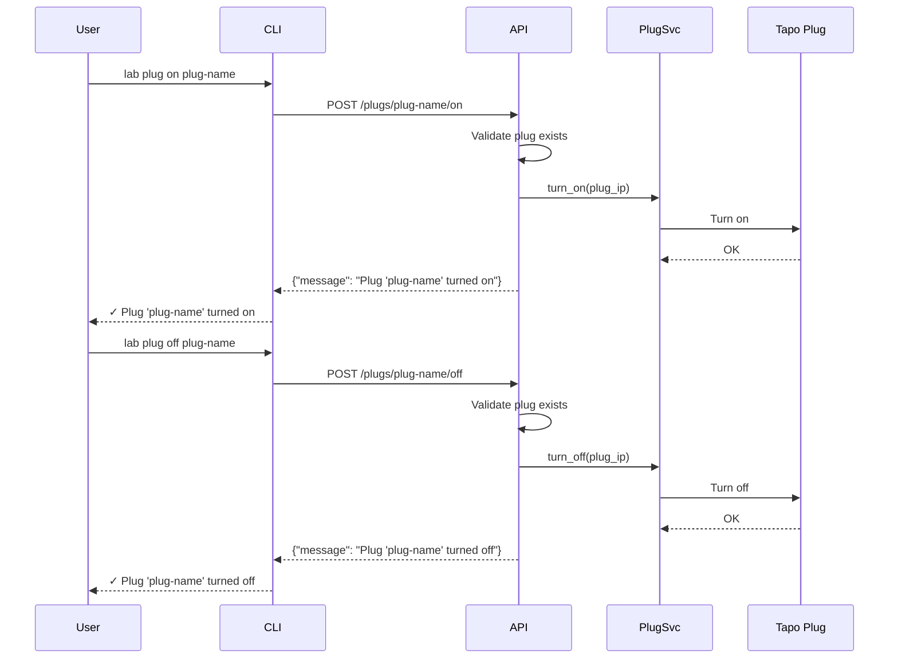
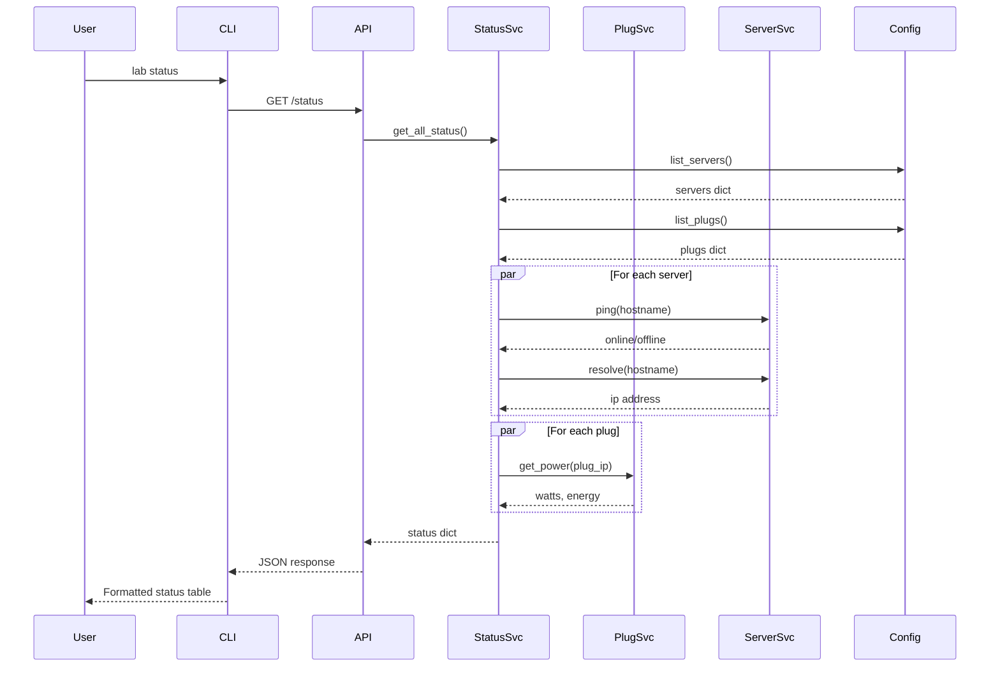

# Power Control Flows

## Power On (Server)

```mermaid
sequenceDiagram
    participant User
    participant CLI
    participant API
    participant PowerSvc
    participant PlugSvc
    participant ServerSvc
    participant Plug as Tapo Plug
    participant Server as Target Server

    User->>CLI: lab on server-name
    CLI->>API: POST /power/on {"name": "server-name"}
    API->>API: Validate server exists, has plug + MAC
    API->>PowerSvc: power_on(server, plug)
    PowerSvc->>PlugSvc: turn_on(plug_ip)
    PlugSvc->>Plug: Turn on
    Plug-->>PlugSvc: OK
    PowerSvc->>ServerSvc: Monitor boot (60s)
    alt Boot detected
        ServerSvc-->>PowerSvc: Server is up
    else Boot not detected
        PowerSvc->>ServerSvc: send_wol(mac)
        ServerSvc->>Server: Magic packet
        PowerSvc->>ServerSvc: Monitor boot (60s)
        ServerSvc-->>PowerSvc: Server is up (or timeout)
    end
    PowerSvc-->>API: {"success": true, "message": "..."}
    API-->>CLI: SSE stream + final result
    CLI-->>User: ✓ Server powered on
```

## Power Off (Server)

```mermaid
sequenceDiagram
    participant User
    participant CLI
    participant API
    participant PowerSvc
    participant PlugSvc
    participant ServerSvc
    participant Plug as Tapo Plug
    participant Server as Target Server

    User->>CLI: lab off server-name
    CLI->>API: POST /power/off {"name": "server-name"}
    API->>API: Validate server exists, has plug
    API->>PowerSvc: power_off(server, plug)
    PowerSvc->>ServerSvc: shutdown(hostname)
    ServerSvc->>Server: SSH sudo poweroff
    ServerSvc-->>PowerSvc: Shutdown sent
    PowerSvc->>PlugSvc: Monitor power drop
    loop Monitor for 120s
        PlugSvc->>Plug: get_power()
        Plug-->>PlugSvc: watts
        PlugSvc-->>PowerSvc: power reading
    end
    PowerSvc->>PlugSvc: turn_off(plug_ip)
    PlugSvc->>Plug: Turn off
    Plug-->>PlugSvc: OK
    PowerSvc-->>API: {"success": true, "message": "..."}
    API-->>CLI: SSE stream + final result
    CLI-->>User: ✓ Server powered off
```

## Direct Plug Control

```mermaid
sequenceDiagram
    participant User
    participant CLI
    participant API
    participant PlugSvc
    participant Plug as Tapo Plug

    User->>CLI: lab plug on plug-name
    CLI->>API: POST /plugs/plug-name/on
    API->>API: Validate plug exists
    API->>PlugSvc: turn_on(plug_ip)
    PlugSvc->>Plug: Turn on
    Plug-->>PlugSvc: OK
    API-->>CLI: {"message": "Plug 'plug-name' turned on"}
    CLI-->>User: ✓ Plug 'plug-name' turned on

    User->>CLI: lab plug off plug-name
    CLI->>API: POST /plugs/plug-name/off
    API->>API: Validate plug exists
    API->>PlugSvc: turn_off(plug_ip)
    PlugSvc->>Plug: Turn off
    Plug-->>PlugSvc: OK
    API-->>CLI: {"message": "Plug 'plug-name' turned off"}
    CLI-->>User: ✓ Plug 'plug-name' turned off
```

## Status Check

```mermaid
sequenceDiagram
    participant User
    participant CLI
    participant API
    participant StatusSvc
    participant PlugSvc
    participant ServerSvc
    participant Config

    User->>CLI: lab status
    CLI->>API: GET /status
    API->>StatusSvc: get_all_status()
    StatusSvc->>Config: list_servers()
    Config-->>StatusSvc: servers dict
    StatusSvc->>Config: list_plugs()
    Config-->>StatusSvc: plugs dict
    par For each server
        StatusSvc->>ServerSvc: ping(hostname)
        ServerSvc-->>StatusSvc: online/offline
        StatusSvc->>ServerSvc: resolve(hostname)
        ServerSvc-->>StatusSvc: ip address
    end
    par For each plug
        StatusSvc->>PlugSvc: get_power(plug_ip)
        PlugSvc-->>StatusSvc: watts, energy
    end
    StatusSvc-->>API: status dict
    API-->>CLI: JSON response
    CLI-->>User: Formatted status table
```
